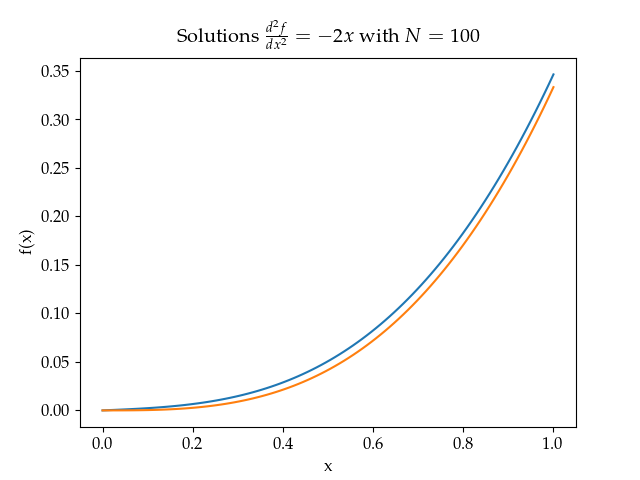
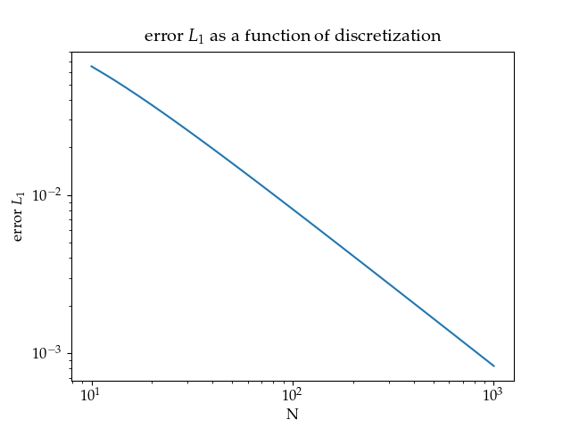

# 1D Laplace equation

The equation is the following

<a href="https://www.codecogs.com/eqnedit.php?latex=\frac{d^2f(x)}{d&space;x^2}&space;=&space;\rho(x)&space;\,&space;\,&space;\,&space;\,&space;\forall&space;x&space;\in&space;[0,&space;L]" target="_blank"></a>

To solve this equation numerically, one must discretize the set [0, L] so that x can take a finite number of values. Let N be an integer, then we have

<a href="https://www.codecogs.com/eqnedit.php?latex=x_i&space;=&space;\frac{L}{N}&space;\,&space;\,&space;\,&space;i=&space;0,&space;1,&space;2,3&space;...&space;N" target="_blank"></a>

The differential operator must also be discretize with the following formula:

<a href="https://www.codecogs.com/eqnedit.php?latex=\frac{d&space;^2f(x)}{dx^2}&space;=&space;\frac{f(x-h)&space;-&space;2f(x)&space;&plus;&space;f(x&plus;h)}{h^2}&space;&plus;&space;\mathcal{O}(h)" target="_blank"></a>

Where h=L/N. Now put everything in the differential equation to get

<a href="https://www.codecogs.com/eqnedit.php?latex=\frac{f(x_i-h)&space;-&space;2f(x_i)&space;&plus;&space;f(x_i&plus;h)}{h^2}&space;&plus;&space;\mathcal{O}(h)&space;=&space;\rho(x_i)&space;\,&space;\,&space;\,&space;i&space;=&space;0,&space;1,&space;2...N" target="_blank"></a>

which is a linear system of equations if we ignore the error on the derivative.

# Border conditions
3 well known border conditions are the following:

### Dirichlet Condition

<a href="https://www.codecogs.com/eqnedit.php?latex=f(0)=&space;a&space;\,&space;\,&space;\,&space;,&space;f(L)=b" target="_blank"></a>

### Newmann Condition

<a href="https://www.codecogs.com/eqnedit.php?latex=f'(0)=&space;a&space;\,&space;\,&space;\,&space;,&space;f'(L)=b" target="_blank"></a>

### Robin Condition

<a href="https://www.codecogs.com/eqnedit.php?latex=a&space;f'(0)&space;&plus;&space;b&space;f(0)&space;=&space;1&space;\,&space;\,&space;\,&space;,&space;c&space;f'(1)&space;&plus;&space;d&space;f(1)&space;=&space;1" target="_blank"></a>

All conditions are specified within the conditions list which followes the following template

``` [['condition name', values] , ['condition name', values']] ```

# Running the code
the function solveFiniteDiff must be called to solve the equation.

__Inputs__
- L      (length of the interval)
- N      (number of points in the mesh)
- conditons list
- func   (function f in the equation)

__Outputs__
- list of x in mesh
- values of f(x)

# Example
Here is the numerical solution f for rho(x) = -2x, L= 1, N= 100

```condition list = [['dirichlet', 0], ['newmann', 1]]```



we can also compute the L1 error between the real solution x^3/3 and the numerical one to see the order of the method.



we see that we have an order of convergence of 1.